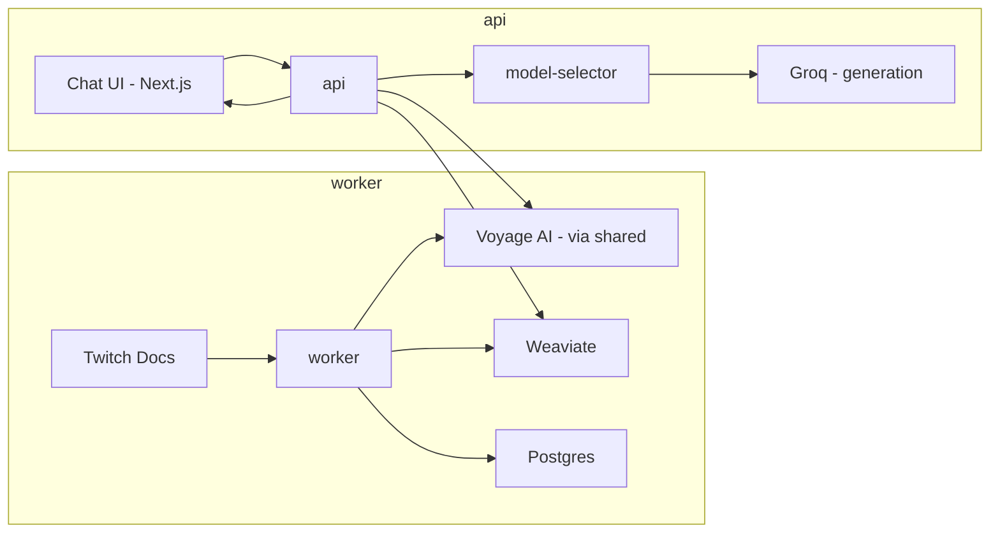

# 01 — Architecture

## Stack
- Backend: Python, Django, Django REST Framework
- Vector DB: Weaviate
- Relational DB: Postgres (doc metadata, chunk records)
- Queue / async: RabbitMQ + Celery (ingestion jobs)
- Embedding provider: Voyage AI, model `voyage-3.5` (1024 dimensions, free tier)
- Generation model: resolved via a model-selector interface; MVP always resolves to Groq
- Frontend: Next.js, React, TypeScript
- Containerization: Docker Compose

## Key Concepts
- **Embedding** — a numeric vector representing a piece of text's meaning, positioned so similar-meaning texts sit close together in vector space. This is what makes "search by meaning" possible, instead of exact keyword matching.
- **Embedding provider** — a hosted API that turns text into an embedding. The same provider/model must be used for both doc chunks and user questions, or their vectors aren't comparable.
- **Similarity search** — given a question's embedding, finding the doc chunks whose embeddings sit closest to it. This is what Weaviate does.

## Project Structure
Three Python codebases, not one monolith:

- **`worker`** — Django project running only as a Celery worker + beat scheduler, no HTTP server. Owns ingestion (`01-doc-ingestion.md`), chunking and embedding (`02-chunking-embedding.md`), and the vector store *write* side (`03-vector-store-retrieval.md`'s indexing FRs).
- **`api`** — Django + DRF project, HTTP only. Owns the vector store *read* side (`03-vector-store-retrieval.md`'s `retrieve()`), LLM integration (`04-llm-integration.md`), and the answer endpoint (`05-rag-answer-api.md`).
- **`shared`** — a plain Python package, not a deployed service. Installed as a local editable dependency inside both `worker` and `api`. Holds the Postgres models (`Document`, `Chunk`, `DocumentProcessingLog`), the Voyage AI client, and the Weaviate client — all things both projects need, so the embedding logic used at ingestion time and the embedding logic used at query time are the same code, not two copies. Per-query logging (`05-rag-answer-api.md`) is a runtime log, not a Postgres model, so it isn't part of this list.

Both `worker` and `api` include `shared`'s Django app in `INSTALLED_APPS` so they can use its models. **`worker` is the sole owner of migrations** — it's the one that runs `makemigrations`/`migrate`; `api` reads and writes the same tables through the shared models but never generates its own migration history. Two services independently managing migrations for the same tables is a real way to get conflicting migration state, so this is a hard rule, not a style preference.

## Components
- `worker` — owns ingestion, chunking, embedding, and vector store indexing (see Project Structure above)
- `api` — owns retrieval, model selection, generation, and the answer endpoint
- `model-selector` — interface inside `api` that resolves which LLM provider/model handles a request; MVP always resolves to Groq's single configured model
- `shared` — Postgres models, Voyage AI client, Weaviate client; imported by both `worker` and `api`
- `frontend` — Next.js chat UI, calls `api`
- `weaviate` — vector store for chunk embeddings
- `postgres` — doc metadata, chunk records, query logs
- `rabbitmq` — message broker for Celery, used by `worker`

## Data Flow

### Ingestion (offline, manual or scheduled trigger)
1. `worker` pulls a defined list of Twitch Developer doc URLs
2. Scrapes and parses each page into raw text
3. Splits raw text into chunks
4. Generates an embedding per chunk via the Voyage AI API (through `shared`) — this is what makes step 3 of the query flow possible
5. Writes chunk text + embedding to Weaviate; writes chunk metadata (source URL, section, timestamp) to Postgres

### Query (online, per user question)
1. Frontend sends question to `api`
2. `api` embeds the question via the same Voyage AI model used in ingestion (through `shared`), so the question's vector is comparable to the chunk vectors
3. `api` queries Weaviate for the top-k chunks closest to the question's embedding
4. `api` asks `model-selector` for a provider/model, assembles a prompt from the question + retrieved chunks, and calls the resolved provider
5. `api` returns the answer with source citations
6. Frontend displays the answer

## Diagram

`shared` (Postgres models, Voyage AI client, Weaviate client) isn't its own node — it's the library both `worker` and `api` import to talk to Voyage AI, Weaviate, and Postgres.

## Key Decisions
- Embeddings via a hosted API (Voyage AI free tier) rather than self-hosted — no local model runtime to manage or resource
- Generation and embeddings are separate providers by necessity — Groq does not offer an embeddings API
- Model resolution goes through a `model-selector` interface rather than calling Groq directly — the interface is shaped to later resolve different models by task type (e.g. fast/cheap vs. heavy/accurate) without changing any caller. MVP implements only the single-provider case: always Groq
- Ingestion and API serving are split into two separate Django projects (`worker`, `api`) rather than one, with a shared package (`shared`) for the code both need — Voyage AI and Weaviate clients, and the Postgres models. `worker` owns migrations so the two services can't develop conflicting migration histories for the same tables
- `worker` and `api` are written stateless, so more replicas could be added later without a redesign; MVP itself runs one replica of each via Docker Compose

## Non-goals
- No Kubernetes or orchestration beyond Docker Compose
- No multi-replica deployment (services are designed to allow it, but MVP runs single instances)
- No real multi-model routing logic — `model-selector` is an interface only, always resolving to Groq
- No caching layer in MVP

## Related Documents
- `00-overview.md` — goals and scope
- `/features` — per-feature requirements
